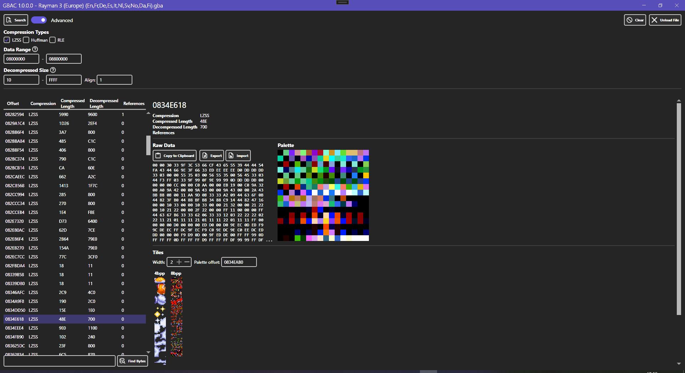
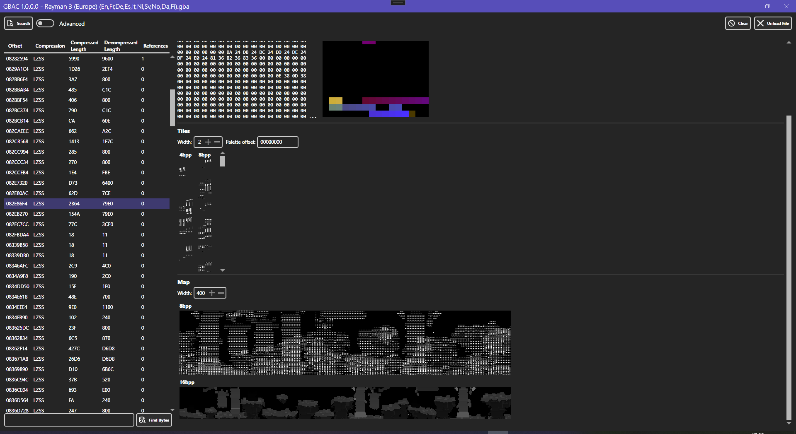
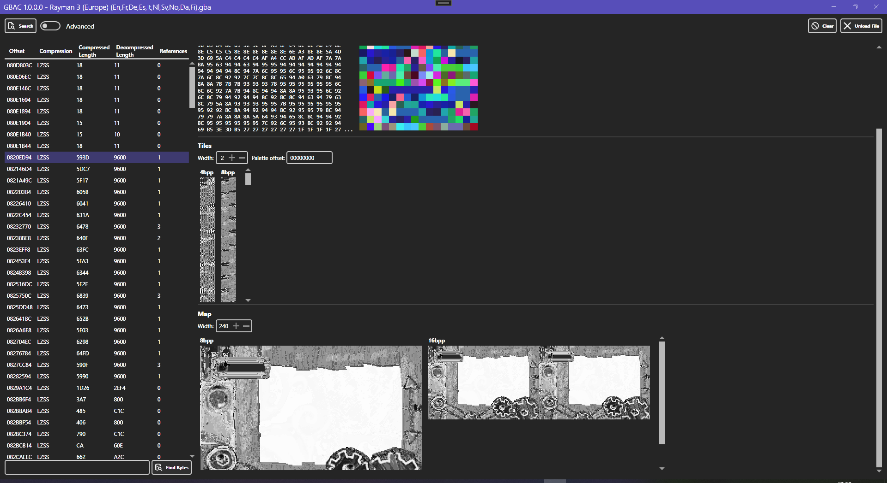

# GBAC - GBA Compressed Data Finder
GBAC is a tool for easily finding compressed data in a GBA ROM. It allows searching the file for compressed data and visualizing the data as a palette, tiles and map. It can also be used to replace compressed data by importing it.

Currently importing Huffman compressed data is not supported. If data is compressed multiple times, such as LZSS+Huffman, only the first compression layer will be decompressed.

## Screenshots

